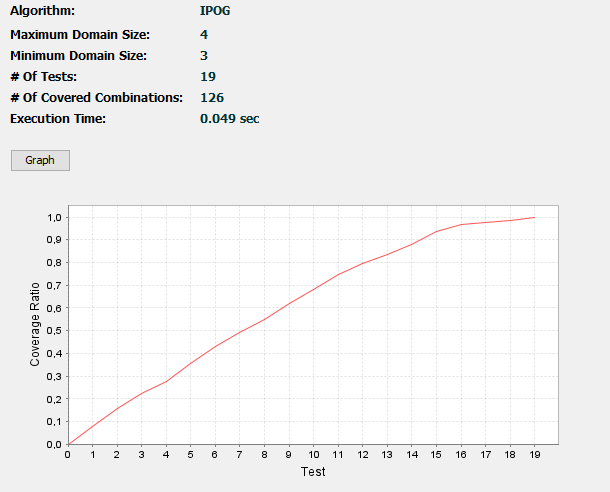
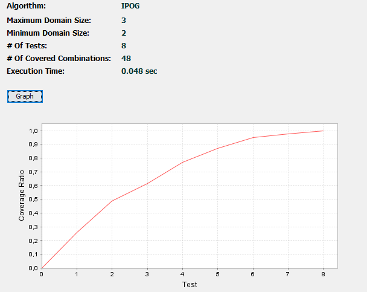
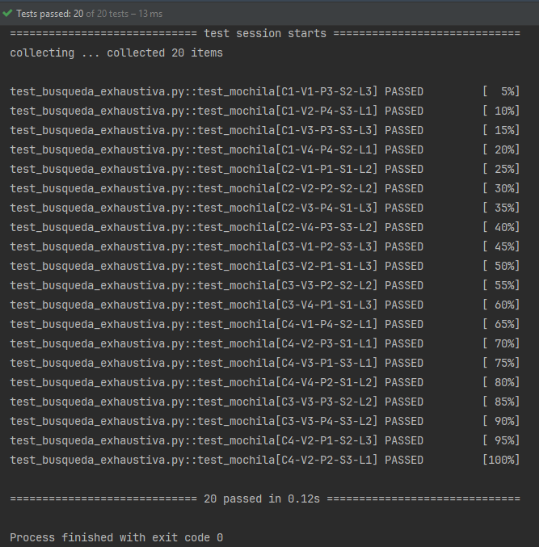
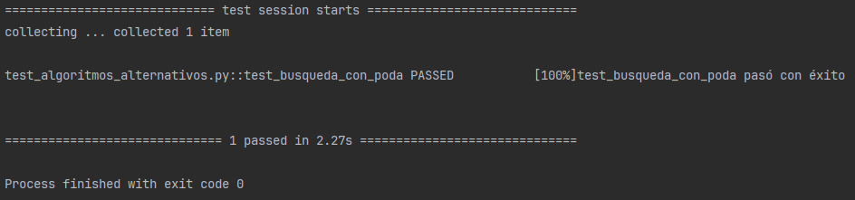
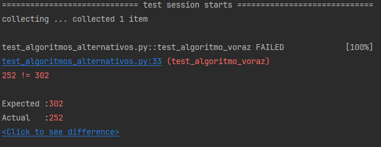
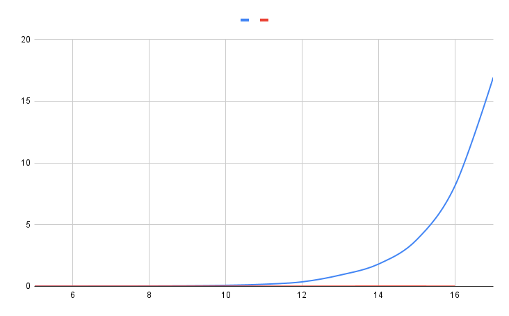
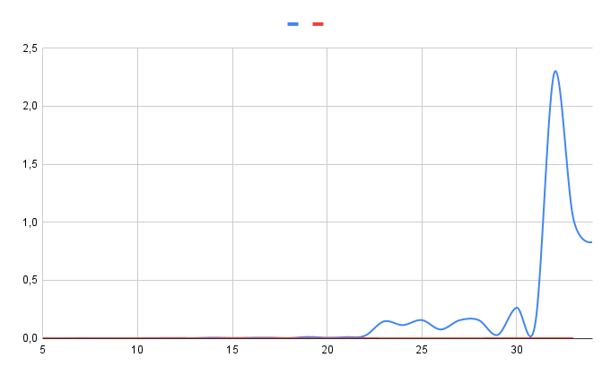
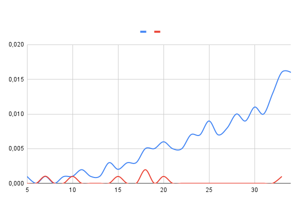

##

***Testing combinatorio de algoritmos que resuelven el Problema de la Mochila***

## BÚSQUEDA EXHAUSTIVA 

### 1. Identificar las dimensiones de interés para los parámetros de entrada y su salida.  

Las dimensiones de interés de una variables son los aspectos que la describen. De esos, vamos a intentar establecer la dimensión principal, que será la dimensión más determinante para las operaciones del programa. En nuestro caso tenemos dos clases, Mochila y Artículo, que tienen los siguientes atributos:

En “Mochila”: 

- Capacidad: Representa el peso máximo que puede contener la mochila. Su tipo de datos es int, y su dimensión principal será su valor numérico.   
- Artículos: Almacena todos los objetos de tipo “Artículo” que se han insertado en la mochila. Es una lista, por lo que su dimensión principal será el número de artículos que contenga, es decir, su tamaño o longitud.

En “Artículo”: 

- Valor: Representa el valor asignado a un artículo específico. Se usa como un entero, y su dimensión principal será su valor numérico.   
- Peso: Representa el peso de un artículo específico. También se usa como un entero, por lo que su dimensión principal será el valor numérico.  
- Seleccionado: Indica si un artículo ha sido seleccionado para entrar en la mochila. Es una variable booleana, y estas variables tienen un dominio finito, solo pueden tomar los valores “true” y “false”. Su dimensión será por tanto el estado booleano (binario) que representa la variable. 

### 2. Identificar las clases de equivalencia, valores límite y valores de prueba. 

| Parámetro | Clase válida | Clase inválida | Valores  | Identificador |
| :---: | :---: | :---: | :---: | ----- |
| **Capacidad** | Cero |  | 0 | C1 |
|  | Entero positivo |  | 20 | C2 |
|  |  |  | 1000 | C3 |
|  |  | Menor que cero | \-1 | C4 |
| **Artículos** | Lista vacía  |  | \[\] | L1 |
|  | Lista con 1 o más artículos |  | \[Artículo, Artículo\] | L2 |
|  |  | Lista con Artículos nulos | \[None\] | L3 |
| **Valor** | Cero |  | 0 | V1 |
|  | Entero positivo |  | 20 | V2 |
|  |  |  | 1000 | V3 |
|  |  | Menor que cero | \-1 | V4 |
| **Peso** | Entero positivo |  | 20 | P1 |
|  |  |  | 1000 | P2 |
|  |  | Menor o igual a cero | 0 | P3 |
|  |  |  | \-1 | P4 |
| **Seleccionado** | Estado booleano |  | True | S1 |
|  |  |  | False | S2 |
|  |  | Valor no booleano | \-1 | S3  |

   

Para probar el programa se han seleccionado valores específicos para cada variable. Así podemos verificar el manejo de casos, tanto válidos como inválidos. Estos son los valores elegidos: 

Para “capacidad”: 

- Cero: ’0’ (C1). Prueba la capacidad mínima permitida. Es adecuado porque el programa debe manejar mochilas con capacidad cero sin permitir la inserción de artículos con peso positivo.  
- Entero positivo: \`20\` (C2), \`1000\` (C3). Prueba la funcionalidad con capacidades válidas. Adecuado para verificar el manejo normal de artículos dentro de la mochila.  
- Menor que cero: \`-1\` (C4). Prueba la validación de valores inválidos. Es adecuado porque el programa debe lanzar una excepción cuando se introduce una capacidad negativa.

Para “artículos”:

- Lista vacía: \`\[\]\` (L1). Verifica que el programa maneje correctamente una mochila sin artículos. Adecuado para probar el comportamiento inicial.  
- Lista con 1 o más artículos:\`\[Articulo, Articulo\]\` (L2). Prueba el manejo de una lista con artículos válidos. Adecuado para verificar la funcionalidad normal de la mochila.  
- Lista con Artículos nulos: \`\[None\]\` (L3). Verifica la validación de entradas nulas. Es adecuado porque el programa debe manejar y rechazar listas que contengan elementos nulos.

Para “valor”: 

- Cero: \`0\` (V1). Prueba el límite inferior del valor. Adecuado para asegurar que los artículos con valor cero sean manejados correctamente.  
- Entero positivo: \`20\` (V2), \`1000\` (V3). Verifica el manejo de valores válidos y positivos. Adecuado para comprobar la funcionalidad estándar del programa.  
- Menor que cero: \`-1\` (V4). Prueba la validación de valores negativos. Es adecuado porque el programa debe rechazar artículos con valores negativos.

Para “peso”:

- Entero positivo: \`20\` (P1), \`1000\` (P2). Verifica el manejo de pesos válidos y positivos. Adecuado para asegurar que los artículos con peso positivo se manejen correctamente.  
- Menor o igual a cero:  \`0\` (P3), \`-1\` (P4). Prueba la validación de pesos no válidos. Es adecuado porque el programa debe rechazar artículos con peso cero o negativo.

Para “seleccionado”: 

- Estado booleano: \`True\` (S1), \`False\` (S2). Verifica que los estados booleanos válidos se manejen correctamente. Adecuado para probar la lógica de selección de artículos.  
- Valor no booleano: \`-1\` (S3). Prueba la validación de valores no booleanos. Es adecuado porque el programa debe manejar y rechazar valores no booleanos para esta variable.

### 3. Identificar las restricciones necesarias para las dimensiones. 

Inicialmente pensamos en las siguientes restricciones: 

C1 -> (¬ L2): Si la capacidad es cero, no puede haber artículos en la lista.  
L1 -> (¬ C2 ^ ¬ C3): Si la lista no tiene artículos, la capacidad no puede ser mayor que cero.  
C1 -> (¬ P1 ^ ¬ P2): Si la capacidad es cero, el peso no puede ser mayor que cero.   
C1 -> (¬ S1): Si la capacidad es cero, no se podrá seleccionar ningún artículo. 

Las dos primeras restricciones finalmente no las hemos puesto en juego, ya que se puede considerar que entran en conflicto con la posibilidad de tener una mochila inicialmente vacía pero con capacidad positiva a la espera de añadir artículos. Vamos a quedarnos entonces con las dos últimas restricciones.

### 4. Especificación ACTS de los valores de prueba. Obtener dos juegos de prueba alternativos. 

ACTS son las siglas de Automated Combinatorial Testing for Software. ACTS es una herramienta desarrollada por el Instituto Nacional de Estándares y Tecnología (NIST) para realizar pruebas de software de manera eficiente usando pruebas combinatorias. Este tipo de pruebas se basa en el principio de que muchos fallos en software son causados por interacciones entre pocos parámetros. En lugar de probar todas las combinaciones posibles de variables (lo que sería impracticable en sistemas complejos), ACTS genera subconjuntos optimizados de pruebas que cubren todas las interacciones relevantes entre pares o pequeños grupos de parámetros.

Esto permite encontrar errores de manera más rápida y con menos casos de prueba en comparación con pruebas exhaustivas, ahorrando tiempo y recursos en el proceso de desarrollo de software.

Se puede encontrar más información y enlaces de descarga en [https://csrc.nist.rip/groups/SNS/acts/](https://csrc.nist.rip/groups/SNS/acts/)

#### 4.1. Juego de pruebas JP1[^1]. 

Los parámetros que usamos en ACTS para JP1 son los siguientes:

[Parameter]  
C (enum) : C1, C2, C3, C4  
V (enum) : V1, V2, V3, V4  
P (enum) : P1, P2, P3, P4  
S (enum) : S1, S2, S3  
L (enum) : L1, L2, L3

[Constraint]  
(C="C1") => ((P != "P1" && P != "P2"))  
(C="C1") => (S != "S1")

El resultado es el siguiente: 

C,V,P,S,L  
C1,V1,P3,S2,L2  
C1,V2,P4,S3,L3  
C1,V3,P3,S3,L1  
C1,V4,P4,S2,L1  
C2,V1,P1,S1,L3  
C2,V2,P2,S2,L2  
C2,V3,P4,S1,L2  
C2,V4,P3,S3,L3  
C3,V1,P2,S3,L1  
C3,V2,P1,S1,L1  
C3,V3,P2,S2,L3  
C3,V4,P1,S1,L2  
C4,V1,P4,S2,L3  
C4,V2,P3,S1,L1  
C4,V3,P1,S3,L2  
C4,V4,P2,S1,L1  
C3,V4,P3,S2,L3  
C3,V3,P4,S3,L3  
C2,V1,P1,S2,L1

#### 4.2. Juego de pruebas JP2[^2]. 

En este caso excluimos los valores que entran dentro de la clase “inválidos”:

[Parameter]  
C (enum) : C1, C2, C3  
L (enum) : L1, L2  
V (enum) : V1, V2, V3  
P (enum) : P1, P2  
S (enum) : S1, S2

[Constraint]  
(C="C1") => ((P != "P1" && P != "P2"))  
(C="C1") => (S != "S1")

El resultado es el siguiente:

C,L,V,P,S  
C2,L2,V1,P2,S2  
C2,L1,V2,P1,S1  
C2,L2,V3,P1,S2  
C3,L1,V1,P2,S1  
C3,L2,V2,P1,S2  
C3,L1,V3,P2,S1  
C2,L2,V1,P1,S1  
C2,L1,V2,P2,S2

### 5. ¿En qué se diferencian los dos juegos de pruebas? ¿Qué implicaciones prácticas tienen dichas diferencias? 

En JP1 hemos tomado todos los valores de la tabla, válidos e inválidos, mientras que en JP2 hemos excluido los inválidos. Esto tendrá ciertas implicaciones prácticas:

- JP1 tiene una cobertura más completa al incluir valores inválidos, por lo que se espera que pruebe que el programa maneja adecuadamente errores y excepciones.   
- Las combinaciones de JP1 generan más casos para validar, por lo que tiene una mayor complejidad y requerirá más tiempo de ejecución.   
- Usando JP2, al centrarnos únicamente en los casos válidos, nos aseguramos que el programa funcione en condiciones normales, pero no podemos saber cómo se tratan las entradas incorrectas o fuera de los límites. Por tanto, podemos considerar que JP2 es incompleto y por sí solo no nos sirve para alcanzar una buena cobertura.   
- Si usamos JP2 no podemos comprobar el manejo de errores y excepciones. Siendo este manejo una de las partes más importantes de las pruebas del software, no podemos asegurar haber hecho un buen trabajo de testeo si solo usamos JP2.  
- Por tanto, JP2 nos sirve para hacer pruebas de funcionalidad del programa, en las que se espera que el programa opere de cierta manera, pero ahí se acaba su utilidad.  
- JP1, por su parte, es más exhaustivo, lo cual es crucial para verificar la robustez y los límites del programa.

### 6. Pruebas de unidades con pytest. Corrección del programa. 

Hemos codificado un archivo test_busqueda_exhaustiva.py para probar el algoritmo con el juego de pruebas JP1[^3]. 

En un primer momento hemos encontrado fallos en los test (12 de los 20 test fallan), lo cual se debe a las siguientes razones. La razón principal es que faltan validaciones en el código, lo que hace que no se produzcan errores esperados durante las pruebas. En la clase “Artículo” no se comprueba que “valor” y “peso” sean válidos, por lo que cuando se espera que se lance una excepción tipo “ValueError” esto no ocurre. En la clase “Mochila” no se valida que la capacidad sea mayor o igual a cero en el constructor, por lo que tampoco se lanza una excepción esperada cuando se intenta crear una mochila con capacidad negativa. En definitiva, se producen fallos en los test porque no se han hecho las validaciones necesarias para manejar los casos de datos inválidos que se prueban en los tests.  

Para que se aprueben los tests creados se han hecho las siguientes modificaciones al código de mochila.py: 

- En la clase “Artículo” se valida que “valor” y “peso” estén dentro de su rango válido.   
- En la clase “Mochila” se valida que “capacidad” sea mayor o igual a cero.   
- Se verifican restricciones antes de crear y agregar artículos. 

El código de busqueda_exhaustiva.py no se ha modificado.  

Una vez hechas las modificaciones, los tests se superan: 

## BÚSQUEDA CON PODA Y ALGORITMO VORAZ. 

### 1. Testing diferencial con busqueda\_exhaustiva como oráculo. ¿Son correctos los algoritmos de búsqueda con poda y voraz? 
Codificamos en test_algoritmos_alternativos.py la función auxiliar genera_aleatorio y las pruebas test_busqueda_con_poda y test_algoritmo_voraz, para comprobar si sus soluciones concuerdan con la búsqueda exhaustiva. 

En el caso de la búsqueda con poda, el test se supera: 

Esto es de esperar si el algoritmo funciona correctamente, ya que ambos están diseñados para encontrar la solución óptima. La búsqueda con poda utiliza las técnicas de poda, descartando ramas del árbol de decisiones que no van a conducir a una solución mejor a la encontrada hasta ahora. Así se reduce el espacio de búsqueda y, en principio, se examinan menos combinaciones que en la búsqueda exhaustiva (que tiene que evaluar todas las posibles combinaciones). Ambas llegan a una solución óptima, por lo que el test debe dar el mismo resultado. 

El caso del algoritmo voraz es diferente, porque este tipo de algoritmos no garantizan que se vaya a encontrar una solución óptima en todos los casos. Se toman decisiones locales, en las que se selecciona la opción de mayor beneficio (o menor coste, depende de la naturaleza del problema), y las decisiones no se revisan más adelante. En nuestro caso el resultado del test es negativo: 

Los algoritmos voraces tienen como ventajas la eficiencia y la menor complejidad, pero es normal que tengan resultados peores (menos óptimos) que otros algoritmos.   
 

### 2. Escalabilidad de los algoritmos. 

La codificación de los algoritmos de comparación test_escalabilidad_exhaustiva_vs_poda y test_escalabilidad_poda_vs_voraz se encuentra en el fichero test_algoritmos_alternativos. py. Se puede comprobar los resultados de ambos algoritmos en los archivos test/escalabilidad_exhaustiva_vs_poda.csv y test/escalabilidad_poda_vs_voraz.csv. 

Esta es la comparación entre el algoritmo de búsqueda exhaustiva y el de búsqueda con poda: 

Este es el resultado de comparar la búsqueda con poda con el algoritmo voraz:

#### 3.1. ¿Qué algoritmo es más rápido? ¿Cómo varía la velocidad de los algoritmos a medida que aumentan los artículos?

Entre la búsqueda exhaustiva y la búsqueda con poda ésta última es la más rápida. En la búsqueda exhaustiva el tiempo aumenta exponencialmente con el número de artículos, mientras que en la poda se mantiene constante y muy por debajo. La escala de los algoritmos es muy diferente, por lo que al compararlos en el gráfico la poda llega como máximo a 0,007 segundos, mientras que la exhaustiva llega a tardar casi 17 segundos. 

Entre la búsqueda con poda y el algoritmo voraz, la diferencia es menor en cuanto a la escala, pero aún así muy significativa. Ya vimos que el algoritmo voraz no es óptimo pero es muy eficiente, y aquí vemos como incluso con 34 artículos el tiempo es de 0,001 segundos. Para la búsqueda con poda siguen siendo bastante bajos, pero no pueden acercarse a la eficiencia del algoritmo voraz.

En resumen, la búsqueda exhaustiva muestra un crecimiento exponencial en el tiempo de ejecución a medida que el número de artículos aumenta. Esto se debe a que explora todas las combinaciones posibles, lo cual es computacionalmente costoso. Por su parte la poda es mucho más eficiente que la búsqueda exhaustiva. El tiempo de ejecución también aumenta con el número de artículos, pero lo hace de manera mucho más gradual, ya que reduce significativamente el número de combinaciones exploradas. Por último el algoritmo voraz es el más rápido de los tres, con tiempos de ejecución casi constantes y muy bajos. Este algoritmo no explora exhaustivamente todas las combinaciones, lo que resulta en tiempos de ejecución muy rápidos.

#### 3.2. En caso de que el algoritmo voraz no sea 100% correcto, ¿se acercan sus soluciones a las obtenidas por busqueda\_exhaustiva y busqueda\_con\_poda? 

Usando el archivo csv generado podemos comparar las soluciones encontradas por los diferentes algoritmos. Podemos ver que en 10 casos el algoritmo voraz llega a la misma solución que la poda (y por tanto que la búsqueda exhaustiva, porque ya hemos visto que son equivalentes). Sus resultados en general son bastante cercanos a los obtenidos por la búsqueda con poda. 

Aunque el algoritmo voraz no es 100% correcto, sus soluciones son generalmente cercanas a las óptimas. Esto es especialmente cierto para casos con menos artículos, donde la diferencia entre el valor óptimo y el valor encontrado por el algoritmo voraz es mínima. 

Podemos concluir que, dependiendo de las aplicaciones que busquemos, puede ser que el algoritmo voraz nos sirva ya que, debido a su rapidez, puede ser una buena opción para problemas grandes donde se necesita una solución rápida y se puede tolerar una ligera pérdida de optimalidad.

## SOLUCIÓN BASADA EN PROGRAMACIÓN DINÁMICA. 

### 1. Implementar una solución al problema de la mochila usando programación dinámica.  

La programación dinámica es una técnica de optimización que reduce el coste de ejecución de un algoritmo al memorizar soluciones parciales que se necesitan para llegar a la solución final. Generalmente, los resultados parciales se almacenan en una tabla y se reutilizan cuando el algoritmo los vuelve a necesitar, evitando así cálculos redundantes. En el caso del problema de la mochila, podemos construir una tabla que almacena el valor máximo obtenible para cada subproblema de capacidad y número de artículos. 

Para plantear el problema de la mochila con programación dinámica vamos a tomar como referencia el manual *Programación y Estructuras de Datos Avanzadas*[^4], páginas 141 y siguientes. Seguimos los siguientes pasos[^5]:

1. Creamos una tabla de dimensiones (n+1) x (W+1), siendo ‘n’ el número de artículos y ‘W’ la capacidad de la mochila.    
2. Cada celda ‘K[i][w]’ de la tabla almacenará el valor máximo obtenible con los primeros ‘i’ artículos y una capacidad de mochila ‘w’.  
3. Se rellenan las entradas de la tabla K mediante un doble bucle que itera sobre los artículos y las capacidades posibles.  
4. Para cada artículo ‘i’ y cada capacidad ‘w’, se decide si se incluye o no el artículo ‘i’ basado en su peso y valor.  
5. Una vez completada la tabla, se reconstruye la solución óptima determinando cuáles artículos fueron seleccionados.  
6. Se recorre la tabla K de manera inversa desde K[n][W], marcando los artículos seleccionados y ajustando los valores de ‘res’ y ‘w’ en consecuencia.  
7. El valor máximo que se puede obtener se encuentra en K[n][W].

2. ### Comparar los tiempos de ejecución con los del algoritmo voraz.  

En test_programacion_dinamica tenemos, en primer lugar, el código que testea la solución de programación dinámica usando búsqueda exhaustiva como oráculo. Así, podemos ver que la solución de programación dinámica es también óptima, pues llega al mismo resultado que la búsqueda exhaustiva (pero mucho más rápido, como ahora veremos). 

En segundo lugar tenemos el test que compara los tiempos de ejecución entre el algoritmo de programación dinámica y el algoritmo voraz. Analizando los resultados obtenemos el siguiente gráfico: 

Podemos observar que el algoritmo voraz sigue siendo imbatible en cuanto a rapidez, pero como ya hemos visto a costa de no alcanzar una solución óptima. El algoritmo de programación dinámica, además de alcanzar una solución óptima, es también muy eficiente. Más incluso que la búsqueda con poda, que como vimos para problemas muy grandes alcanzaba hasta los 2,29 segundos de ejecución. La programación dinámica llega a la misma solución óptima pero apenas emplea 0,016 segundos en el tamaño mayor del problema. 

La elección de un algoritmo u otro vendrá dada por las características del programa que queremos construir y de los requisitos del problema. Si trabajamos con aplicaciones en las que la precisión es crucial es preferible la solución de programación dinámica, aunque pueda ser más complejo de implementar. Si tenemos aplicaciones de tiempo real en las que necesitamos una respuesta rápida y se puede tolerar una solución subóptima, el algoritmo voraz puede ser más indicado. 

En nuestro caso del problema de la mochila, los resultados nos muestran que la programación dinámica nos da una solución que tiene un buen equilibrio entre rapidez y calidad.   

[^1]:   Las especificaciones ACTS de JP1 se encuentran en el fichero JP1.xml. Los resultados se encuentran en el fichero JP1-output.csv.

[^2]:  Las especificaciones ACTS de JP2 se encuentran en el fichero JP2.xml. Los resultados se encuentran en el fichero JP2-output.csv.

[^3]:  El código puede encontrarse en el archivo test_busqueda_exhaustiva.py.

[^4]:  Lourdes Araujo Serna, Raquel Martínez Unanue, Miguel Rodríguez Artacho. Ed CEURA,  2016 

[^5]:  El código puede encontrarse en el archivo programacion_dinamica.py.

